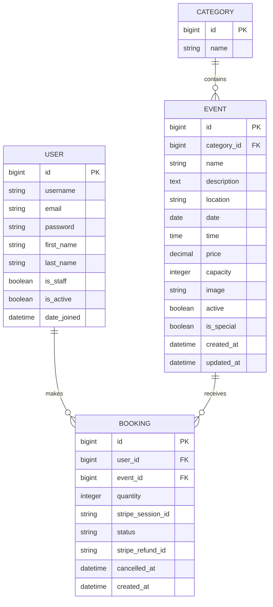

# Event Horizon

* * *

## Table of Contents

- [Overview](#overview)
- [Purpose](#purpose)
- [Target Audience](#target-audience)
- [Features](#features)
- [Design Details](#design-details)
- [Built With](#built-with)
- [Libraries Used](#libraries-used)
- [Project Structure](#project-structure)
- [Database Schema](#database-schema)
- [Viewing the Site Locally](#viewing-the-site-locally)
- [Deployment](#deployment)
- [Accessibility & Responsiveness](#accessibility--responsiveness)
- [User Stories](#user-stories)
- [User Story Mapping](#user-story-mapping)
- [User Story Validation](#user-story-validation)
- [Wireframes](#wireframes)
- [Testing](#testing)
- [Development Challenges](#development-challenges)
- [Lessons Learned](#lessons-learned)
- [Reflection](#reflection)
- [Features Changed During Development](#features-changed-during-development)
- [Future Features](#future-features)
- [Credits](#credits)

* * *

# Overview

Event Horizon is a full-stack event discovery and booking website built with Django.

The site allows visitors to browse upcoming events, search for events and filter them by category. Visitors can explore individual event pages before creating an account, while registered users can purchase places at events and manage their bookings through their profile.

The event catalogue is database-driven, allowing event information, categories, prices, dates, locations and available capacity to be managed dynamically. Event images are stored using Amazon S3, allowing media files to be handled separately from the application itself.

The booking system uses Stripe Checkout to process payments. A booking is only created after successful payment has been confirmed through the Stripe webhook, helping to prevent unpaid bookings from occupying event capacity. Users can view their confirmed bookings and cancel eligible bookings, with cancelled places returned to the event's available capacity.

Event Horizon also contains a dedicated **Not For The Faint Of Heart** category. Standard areas of the website maintain a clean and welcoming event-booking experience, while this category introduces subtle visual changes and glitches to create a darker and less predictable atmosphere.

The project was developed as a full-stack application with a focus on database-driven functionality, authentication, payment processing, event capacity management and responsive user experience.

* * *

# Purpose

The purpose of Event Horizon is to provide users with a straightforward way to discover, explore and book events online, while providing administrators with control over the event catalogue.

The project was developed to demonstrate the practical use of:

- Django and Python for full-stack web development
- A relational database for storing event, user and booking information
- User authentication and account management
- Database-driven event discovery
- Search and category filtering
- Event capacity and availability management
- Secure online payments through Stripe
- Stripe webhooks for confirming successful payments
- Booking management and cancellation
- Administrator event management
- Image and media storage using Amazon S3
- Static file management for deployment
- Responsive front-end design
- A distinctive visual identity built around the Event Horizon theme

The project also aims to make the experience of discovering events enjoyable rather than purely functional. The **Not For The Faint Of Heart** category provides an additional layer to the site's design by deliberately disrupting the otherwise predictable presentation of the event catalogue.

* * *

# Target Audience

Event Horizon is designed for three main groups of users.

### Visitors

Visitors can browse upcoming events, search the event catalogue and filter events by category without needing to create an account.

### Registered Users

Registered users can purchase places at events, view their bookings and cancel eligible bookings through their account.

### Administrators

Administrators can manage the event catalogue, including creating and editing events, assigning categories, setting event capacity and viewing bookings.

* * *

# Features

<details>
<summary><strong>Click to expand features</strong></summary>

<br>

## Homepage

The homepage provides an introduction to Event Horizon and acts as the main starting point for discovering events.

Upcoming active events are retrieved dynamically from the database rather than being hard-coded into the page.

The homepage includes:

- A featured event area
- A scrolling event ticker
- Featured event cards
- Links to individual events
- Links to event categories
- Calls to action encouraging users to explore the catalogue
- Access to event search and discovery functionality

This allows the homepage content to change automatically as events are added, updated or become inactive.

## Event Catalogue

Visitors can browse upcoming events through the main event catalogue.

Each event can include:

- Event name
- Description
- Category
- Date
- Time
- Location
- Price
- Event image
- Maximum capacity
- Remaining availability

Event information is stored in the database, allowing the catalogue to be updated through the administrator functionality.

## Search

Search functionality allows users to find events based on their interests without having to manually browse the entire catalogue.

Search is available throughout the site so that users can continue discovering events while navigating between different pages.

## Category Filtering

Events can be filtered by category to help users narrow down the available choices.

Categories are database-driven and are also used throughout the site to connect related events and provide alternative ways of discovering content.

## Event Details

Each event has its own detail page containing the relevant information required before making a booking.

The page displays the event's details, image, price and current availability.

The available booking options are also determined by the event's current capacity.

## Event Capacity

Event capacity is controlled through the event data.

The system calculates how many places have already been booked and uses this information to determine how many places remain available.

When an event reaches capacity, it is treated as sold out.

Sold-out events are visually identified and the booking option is disabled, preventing users from purchasing places that are no longer available.

When a booking is cancelled, the released places are returned to the event's available capacity.

## User Accounts

Visitors can create an account and log in to access booking functionality.

Authentication allows bookings to be associated with individual users and provides users with access to their personal booking information.

Users can also log out securely when they have finished using their account.

## Stripe Checkout

Event Horizon uses Stripe Checkout to process payments for event bookings.

The payment process separates the payment from the creation of the booking. A user selects their desired event and quantity before being redirected to Stripe to complete the transaction.

The booking is not considered confirmed simply because the checkout process was started.

## Stripe Webhooks

Stripe webhooks are used to confirm successful payments.

When Stripe confirms a successful payment, the webhook processes the event and creates the corresponding booking.

This provides a more reliable payment flow than creating a booking before payment has been confirmed.

Successful bookings are then displayed to the user through the confirmation and profile functionality.

## Booking Management

Registered users can view their bookings through their profile.

Booking information allows users to keep track of the events they have purchased places for.

Eligible bookings can also be cancelled.

When a booking is cancelled, the associated refund is processed and the event's available capacity is updated so that the released places can become available to other users.

## Administrator Management

Administrators can manage the event catalogue through Django's administration functionality.

Administrators can:

- Create events
- Edit existing events
- Manage event descriptions
- Assign event categories
- Set event dates and times
- Set event prices
- Set event capacity
- Add event images
- View booking information

This provides central control over the event catalogue while allowing the customer-facing site to update dynamically.

## Event Images and Media

Event images are stored using Amazon S3 rather than relying entirely on the application's local filesystem.

Django's storage functionality is configured to communicate with S3, with Boto3 providing the AWS integration.

This allows uploaded event images to remain available when the application is deployed and avoids relying on files stored directly on the Heroku application filesystem.

## Not For The Faint Of Heart

The **Not For The Faint Of Heart** category provides a deliberate contrast to the standard Event Horizon experience.

Events within this category retain the same underlying booking functionality as other events, but their presentation introduces subtle visual effects, including glitching and shifting elements.

The intention is for the website to initially feel like a conventional event-booking platform before becoming increasingly unsettling when users encounter this section.

The effect is deliberately restrained rather than turning the entire site into a horror-themed interface.

## Sold-Out Events

Sold-out events receive a dedicated visual treatment to make their status immediately clear.

The event card is visually muted with a sold-out overlay, while the booking option is removed or disabled.

This provides a clear indication that the event is no longer available and prevents users from attempting to purchase additional places.

## Responsive Design

The site has been designed to remain usable across desktop, tablet and mobile screen sizes.

Responsive styling has been applied to the navigation, event catalogue, authentication pages, event details and booking-related content.

Particular attention has been given to the mobile navigation and spacing of interface elements so that content remains accessible on smaller screens.

## Static Files

Django's static file handling is used for the project's CSS, JavaScript and other static assets.

The project is configured to collect static files during deployment so that the front-end assets are available in the production environment.

</details>

* * *

# Design Details

Event Horizon was designed around the idea of creating an event booking platform that initially feels familiar and easy to use, while gradually introducing a darker and more unusual visual identity.

The standard sections of the website use a clean layout with clear navigation, event cards and straightforward calls to action. The aim is to make finding and booking an event simple without overwhelming the user with unnecessary interface elements.

The visual identity changes when users encounter the **Not For The Faint Of Heart** category. Rather than creating an entirely separate horror-themed website, the design uses subtle visual disruption to make the experience feel increasingly unusual.

This includes:

- Glitching and shifting visual elements
- Changes to the presentation of special events
- A darker atmosphere within the relevant section
- Subtle animation rather than excessive effects
- Maintaining the same underlying navigation and booking functionality

This contrast was intentional. The website is designed to initially establish trust and familiarity before introducing something unexpected.

## Navigation

The navigation provides access to the main areas of the website while adapting to smaller screen sizes.

Users can navigate between the event catalogue, categories, account functionality and other key areas of the site without needing to return to the homepage.

Search functionality is also available throughout the site, allowing users to continue looking for events while navigating between pages.

## Event Cards

Event cards provide a compact way of displaying the most important information about an event.

Cards include relevant information such as:

- Event image
- Event name
- Category
- Date
- Location
- Price
- Availability
- Link to view the event

The cards also respond to the current availability of an event. When an event sells out, the card is visually muted and displays a dedicated sold-out treatment rather than continuing to present the event as bookable.

## User Feedback

The application provides feedback to users following important actions such as:

- Logging in or out
- Creating an account
- Completing a booking
- Cancelling a booking
- Attempting to interact with unavailable events
- Searching for events

This helps users understand the result of their actions without having to infer what happened from a change in the page alone.

* * *

# Built With

Event Horizon was developed using the following technologies:

| Technology | Purpose |
|---|---|
| **HTML5** | Page structure and semantic markup |
| **CSS3** | Layout, responsive design and visual styling |
| **JavaScript** | Client-side interaction and dynamic behaviour |
| **Python** | Backend application logic |
| **Django** | Full-stack web framework |
| **PostgreSQL** | Relational database |
| **Stripe** | Payment processing |
| **Amazon S3** | Media storage |
| **Heroku** | Application deployment |
| **Git & GitHub** | Version control and source-code management |

* * *

# Libraries Used

<details>
<summary><strong>Click to expand libraries and dependencies</strong></summary>

<br>

| Library | Purpose |
|---|---|
| **Django** | Core web framework |
| **django-allauth** | User registration and authentication |
| **django-storages** | Integration with external storage services |
| **boto3** | Amazon S3 integration |
| **django-summernote** | Rich text editing for event content |
| **dj-database-url** | Database URL configuration |
| **Stripe** | Payment processing and webhook integration |
| **Requests** | HTTP requests |

</details>

* * *

# Project Structure

Event Horizon follows Django's standard project structure, separating the main project configuration from individual applications responsible for specific areas of functionality.

The main areas of the project include:

- **Events**  
  Responsible for the event catalogue, event information, categories, availability and event management.

- **Bookings**  
  Responsible for creating and managing customer bookings, including the relationship between users and events.

- **Profiles / User functionality**  
  Responsible for user accounts and displaying a user's booking information.

- **Home**  
  Responsible for the homepage and event discovery content.

- **Event Horizon**  
  Contains the main Django project configuration, settings and URL configuration.

- **Static files**  
  Contains the project's CSS, JavaScript and other front-end assets.

- **Templates**  
  Contains the HTML templates used to render the site's pages.

* * *

# Database Schema

Event Horizon uses Django's relational database system to store users, event categories, events and customer bookings.

The project uses Django's built-in `User` model for authentication rather than defining a custom user model. Application-specific data is stored using the `Category`, `Event` and `Booking` models.

## Entity Relationship Diagram



## User

User accounts are provided by Django's built-in authentication system.

| Field                      | Purpose                                                                         |
| -------------------------- | ------------------------------------------------------------------------------- |
| `id`                       | Primary key identifying the user.                                               |
| `username`                 | Unique username used to identify the account.                                   |
| `email`                    | Email address used by Event Horizon for booking and cancellation communication. |
| `password`                 | Securely hashed account password managed by Django.                             |
| `first_name` / `last_name` | Optional name information provided by Django's user model.                      |
| `is_staff`                 | Determines whether the user can access Django administration functionality.     |
| `is_active`                | Determines whether the account is active.                                       |
| `date_joined`              | Records when the account was created.                                           |

Django also manages authentication-related fields and relationships such as permissions and groups.

## Category

The `Category` model groups related events.

| Field  | Type             | Purpose                     |
| ------ | ---------------- | --------------------------- |
| `id`   | `BigAutoField`   | Primary key.                |
| `name` | `CharField(100)` | Name of the event category. |

Categories are ordered alphabetically by name.

### Relationship

A category can contain **many events**, while each event belongs to **one category**.

`Category to Event` is therefore a **one-to-many relationship**.

The relationship uses `on_delete=models.CASCADE`, meaning deleting a category also deletes the events assigned to it.

## Event

The `Event` model stores the main event catalogue.

| Field         | Type                   | Purpose                                                                        |
| ------------- | ---------------------- | ------------------------------------------------------------------------------ |
| `id`          | `BigAutoField`         | Primary key.                                                                   |
| `category`    | `ForeignKey(Category)` | Category containing the event.                                                 |
| `name`        | `CharField(200)`       | Event name.                                                                    |
| `description` | `TextField`            | Full event description.                                                        |
| `location`    | `CharField(255)`       | Event location.                                                                |
| `date`        | `DateField`            | Date of the event.                                                             |
| `time`        | `TimeField`            | Start time of the event.                                                       |
| `price`       | `DecimalField(8, 2)`   | Price of one event place.                                                      |
| `capacity`    | `PositiveIntegerField` | Maximum number of places available.                                            |
| `image`       | `ImageField`           | Optional event image uploaded under `events/`.                                 |
| `active`      | `BooleanField`         | Controls whether the event is available through the customer-facing catalogue. |
| `is_special`  | `BooleanField`         | Identifies events receiving the special Event Horizon presentation.            |
| `created_at`  | `DateTimeField`        | Timestamp created automatically when the event is added.                       |
| `updated_at`  | `DateTimeField`        | Timestamp updated automatically whenever the event changes.                    |

Events are ordered by date and then time.

### Model Behaviour

`places_booked` calculates the number of places occupied by bookings whose status is `confirmed`.

`places_remaining` subtracts the confirmed booked places from the event capacity.

These calculated properties allow event availability and sold-out behaviour to remain synchronized with booking records.

### Relationships

Each event belongs to **one category**, while a category can contain many events.

An event can also have **many bookings**, while each booking relates to one event.

Deleting an event currently cascades to its associated bookings.

## Booking

The `Booking` model connects a registered user to an event they have purchased places for.

| Field               | Type                   | Purpose                                                                                            |
| ------------------- | ---------------------- | -------------------------------------------------------------------------------------------------- |
| `id`                | `BigAutoField`         | Primary key.                                                                                       |
| `user`              | `ForeignKey(User)`     | User who owns the booking.                                                                         |
| `event`             | `ForeignKey(Event)`    | Event being booked.                                                                                |
| `quantity`          | `PositiveIntegerField` | Number of places included in the booking.                                                          |
| `stripe_session_id` | `CharField(255)`       | Unique Stripe Checkout Session identifier used to associate payment confirmation with the booking. |
| `status`            | `CharField(20)`        | Booking state. Either `confirmed` or `cancelled`.                                                  |
| `stripe_refund_id`  | `CharField(255)`       | Optional Stripe refund identifier recorded after cancellation.                                     |
| `cancelled_at`      | `DateTimeField`        | Optional timestamp recording when the booking was cancelled.                                       |
| `created_at`        | `DateTimeField`        | Timestamp recorded when the booking is created.                                                    |

### Model Behaviour

`total_price` calculates the booking value using:

```text
event price x booking quantity
```

Only bookings with a `confirmed` status contribute to an event's booked capacity. Cancelled bookings therefore release their places back into the event's available capacity.

`stripe_session_id` is unique, helping prevent the same Stripe Checkout Session from being represented by multiple booking records.

### Relationships

A user can have **many bookings**, while each booking belongs to **one user**.

An event can have **many bookings**, while each booking belongs to **one event**.

Both relationships currently use cascading deletion:

* deleting a user deletes that user's associated bookings;
* deleting an event deletes bookings associated with that event.

## Relationship Summary

| Parent     | Child     | Relationship |
| ---------- | --------- | ------------ |
| `User`     | `Booking` | One-to-many  |
| `Category` | `Event`   | One-to-many  |
| `Event`    | `Booking` | One-to-many  |

This structure avoids duplicating user and event information inside booking records. Bookings reference the existing user and event through foreign keys, allowing the application to retrieve related information using Django's ORM.

* * *

# Viewing the Site Locally

To run Event Horizon locally, clone the repository and create a Python virtual environment.

```bash
git clone https://github.com/MSR-Projects7274/event-horizon.git
cd event-horizon
```

Create and activate a virtual environment:

### Windows

```bash
python -m venv venv
venv\Scripts\activate
```

### macOS / Linux

```bash
python3 -m venv venv
source venv/bin/activate
```

Install the project dependencies:

```bash
pip install -r requirements.txt
```

Create a `.env` file containing the required environment variables.

These include the appropriate database, Django secret key, Stripe credentials and external storage credentials.

Run the database migrations:

```bash
python manage.py migrate
```

Create a superuser if administrator access is required:

```bash
python manage.py createsuperuser
```

Run the development server:

```bash
python manage.py runserver
```

The application can then be accessed through the local development server.

> **Note:** Secret keys, Stripe credentials, database credentials and AWS credentials should never be committed to the repository. These values should be stored in environment variables.

* * *

# Deployment

<details>
<summary><strong>Click to expand deployment information</strong></summary>

<br>

Event Horizon is deployed using Heroku.

The application uses the Heroku Python buildpack and is deployed on the **Heroku-24 stack**.

The deployment process installs the dependencies listed in `requirements.txt` and runs Django's `collectstatic` command to prepare the application's static files.

External media storage is handled through Amazon S3 using `django-storages` and Boto3. This prevents uploaded event images from relying on Heroku's ephemeral application filesystem.

## Deployment Configuration

The project uses environment variables for sensitive configuration, including:

- Django secret key
- Database URL
- Stripe public key
- Stripe secret key
- Stripe webhook secret
- AWS access credentials
- AWS storage bucket configuration

These values are deliberately excluded from version control.

## Static Files

Django's static files are collected during the Heroku build process.

The deployment initially encountered an issue where `collectstatic` failed because a required package was missing from the production dependencies. The dependency configuration was subsequently corrected so that the deployment environment contained the packages required by the application.

</details>

* * *

# Accessibility & Responsiveness

Event Horizon was designed with accessibility and responsive behaviour in mind.

The interface uses clear headings, readable text, identifiable buttons and consistent navigation to help users understand the available actions.

The layout adapts to different screen sizes, with particular attention given to:

- Mobile navigation
- Event cards
- Event detail pages
- Search controls
- Authentication forms
- Booking controls
- Profile and booking pages
- Spacing and alignment on smaller screens

Interactive elements are presented as clear actions, while unavailable functionality such as sold-out bookings is visually differentiated from available actions.

The site was tested across different viewport sizes during development to identify layout problems and ensure that important content remained accessible on smaller displays.

* * *

# User Stories

The following user stories were used to identify the core requirements of Event Horizon and guide the development of the customer and administrator functionality.

## Customer

- As a visitor, I want to browse upcoming events so that I can find something I am interested in.
- As a visitor, I want to filter events by category so that I can quickly find relevant events.
- As a user, I want to create an account so that I can book events.
- As a user, I want to purchase a place at an event so that I can attend it.
- As a user, I want to see my bookings so that I can keep track of upcoming events.
- As a user, I want to cancel an eligible booking so that I can free up my place.

## Administrator

- As an administrator, I want to create events so that customers can book them.
- As an administrator, I want to edit event information so that the catalogue remains accurate.
- As an administrator, I want to control event capacity so that bookings cannot exceed available spaces.
- As an administrator, I want to view bookings so that I can manage attendance.

* * *

# User Story Mapping

| User Story | Feature | Implementation
|---|---|---|
| As a visitor, I want to browse upcoming events so that I can find something I am interested in. | Event catalogue | Dynamic event listing |
| As a visitor, I want to filter events by category so that I can quickly find relevant events. | Category filtering | Database-driven categories and filtering |
| As a user, I want to create an account so that I can book events. | User accounts | Django authentication |
| As a user, I want to purchase a place at an event so that I can attend it. | Booking and checkout | Stripe Checkout and webhook confirmation |
| As a user, I want to see my bookings so that I can keep track of upcoming events. | Booking management | User booking/profile functionality |
| As a user, I want to cancel an eligible booking so that I can free up my place. | Booking cancellation | Cancellation, refund and capacity update |
| As an administrator, I want to create events so that customers can book them. | Event management | Django administration |
| As an administrator, I want to edit event information so that the catalogue remains accurate. | Event management | Django administration |
| As an administrator, I want to control event capacity so that bookings cannot exceed available spaces. | Capacity management | Dynamic availability and sold-out handling |
| As an administrator, I want to view bookings so that I can manage attendance. | Booking management | Django administration |

* * *

# User Story Validation

<details>
<summary><strong>Click to expand user story validation</strong></summary>

<br>

Each user story was tested against the functionality implemented in the final application.

| User Story | Validation |
|---|---|
| Browse upcoming events | Users can access the event catalogue and view active upcoming events. |
| Filter events by category | Users can select categories to narrow the displayed events. |
| Create an account | Visitors can register for an account and authenticate successfully. |
| Purchase a place | Registered users can select places and complete payment through Stripe Checkout. |
| See bookings | Completed bookings are associated with the user's account and can be viewed through the profile. |
| Cancel an eligible booking | Eligible bookings can be cancelled and the associated refund is processed. |
| Create events | Administrators can create events through the Django administration interface. |
| Edit event information | Administrators can update existing event information. |
| Control event capacity | Available places are calculated from event capacity and existing bookings. |
| View bookings | Administrators can view booking records through the administration interface. |

</details>

* * *

# Wireframes

The wireframes used during development will be included in this section to demonstrate the original layout and design planning for the project.

Screenshots of the final implemented pages will also be included where appropriate to demonstrate how the original design developed into the finished application.

* * *

# Testing

Event Horizon uses a combination of automated Django tests and manual browser-based testing.

The automated test suite currently contains **54 passing tests** covering authentication, event discovery, booking behaviour, Stripe Checkout, webhook handling, refunds, capacity management and user permissions.

Manual testing has also been carried out across the main user journeys, administrator functionality, form validation, error handling, responsive layouts and accessibility. **64 completed manual checks currently pass**, with event-image verification pending until final imagery is uploaded. Production-specific testing will be completed against the final Heroku deployment.

Full testing procedures, results, discovered issues and pending production checks are documented separately:

**[View the complete testing documentation](TESTING.md)**

* * *

# Development Challenges

<details>
<summary><strong>Click to expand development challenges</strong></summary>

<br>

The development of Event Horizon involved several challenges, particularly around integrating multiple systems into a single full-stack application.

## Stripe Integration

One of the more significant challenges was adapting the payment workflow to work correctly with the current versions of Django and Stripe.

The booking process needed to ensure that a booking was not created simply because a user had reached the checkout stage.

The final implementation uses Stripe Checkout followed by webhook confirmation. This means that the booking is created only after Stripe confirms the successful payment.

This required careful handling of Stripe's payment information and webhook events.

## Booking and Capacity Management

Another challenge was ensuring that event capacity remained accurate as bookings were created and cancelled.

The application calculates the number of places already booked and uses this value to determine remaining capacity.

Additional logic was required to ensure that sold-out events could not continue accepting bookings.

Cancellation also needed to update the available capacity so that released places could become available again.

## External Media Storage

Moving uploaded event images away from the application's local filesystem introduced additional configuration requirements.

Django's storage backend had to be configured to communicate with Amazon S3, with the appropriate AWS credentials and bucket configuration supplied through environment variables.

## Deployment

Deployment introduced additional challenges because the production environment does not behave exactly like the local development environment.

One issue encountered during deployment occurred when Heroku attempted to run Django's `collectstatic` command and encountered a missing dependency.

The build initially failed with a `ModuleNotFoundError` for `crispy_forms`, preventing Heroku from completing the static-file collection process.

The dependency configuration was updated to ensure that all packages required by the application were available during deployment.

## Responsive Design

The site's navigation, authentication pages and event cards required repeated adjustments to ensure that elements remained correctly positioned on smaller screens.

Particular attention was given to spacing, navigation behaviour and preventing interface elements from becoming cramped or overlapping.

</details>

* * *

# Lessons Learned

<details>
<summary><strong>Click to expand lessons learned</strong></summary>

<br>

Developing Event Horizon provided experience across several areas of full-stack development.

The project reinforced the importance of designing database relationships before building functionality around them. Event capacity, bookings and users all depend on accurate relationships between different parts of the application.

The project also demonstrated the importance of separating payment confirmation from booking creation. Using Stripe webhooks provided a more reliable way of confirming that a payment had actually succeeded before creating a booking.

External storage also provided useful experience in understanding how production applications handle uploaded media differently from local development environments.

Finally, the project highlighted the importance of testing deployment configuration rather than assuming that code which works locally will automatically work in production.

</details>

* * *

# Reflection

<details>
<summary><strong>Click to expand reflection</strong></summary>

<br>

Event Horizon provided an opportunity to bring together the full range of skills developed throughout the course into a single application.

The project required more than simply creating individual pages. The event catalogue, authentication, booking system, payment processing, capacity management, media storage and administrator functionality all needed to work together.

One of the most valuable parts of the project was developing the booking workflow. The final system demonstrates how a real-world application can separate the user's request to make a purchase from the actual confirmation of that purchase.

The project also allowed greater experimentation with visual design. The **Not For The Faint Of Heart** category provided an opportunity to move beyond a conventional event-booking interface and introduce a distinctive element without compromising the core functionality of the site.

Overall, the project demonstrated the importance of planning, testing and adapting during development rather than treating the original design as fixed.

</details>

* * *

# Features Changed During Development

<details>
<summary><strong>Click to expand development changes</strong></summary>

<br>

Several features evolved during development as the project was tested and refined.

### Event Catalogue

The original event catalogue developed into a more dynamic system using database-driven content, category filtering, search functionality and availability information.

### Homepage

The homepage was expanded beyond a simple event listing to include featured events, a scrolling event ticker, category discovery and calls to action.

### Booking System

The booking process evolved into a full payment-confirmed workflow using Stripe Checkout and webhooks.

### Event Capacity

Capacity management was expanded to provide dynamic availability and dedicated sold-out handling.

### Sold-Out Presentation

Rather than simply preventing a booking when an event reached capacity, sold-out events were given a dedicated visual treatment so that their status was immediately clear to users.

### Not For The Faint Of Heart

The special category developed into a deliberate visual contrast to the standard Event Horizon interface, using subtle glitching and shifting effects.

### Media Storage

Event images were moved towards external storage using Amazon S3 to provide a more suitable solution for the deployed application.

### Responsive Design

The layout and navigation were repeatedly refined during development to improve the experience across different screen sizes.

</details>

* * *

# Future Features

<details>
<summary><strong>Click to expand future features</strong></summary>

<br>

Potential future improvements could include:

- Event ratings and reviews
- Calendar integration
- Email reminders for upcoming events
- Waitlists for sold-out events
- More advanced event filtering
- Improved administrator reporting
- Downloadable tickets
- QR-code based event tickets
- Additional payment options
- More advanced notification functionality

</details>

* * *

# Credits

The following resources and technologies were used during the development of Event Horizon:

- Django documentation
- Python documentation
- Stripe documentation
- Amazon Web Services documentation
- Heroku documentation
- GitHub documentation

- Favicons: Favicon.io
- Bug fixes and advice: ChatGPT provided guidance, code extracts and troubleshooting support
- Favicon Design: Perchance.org